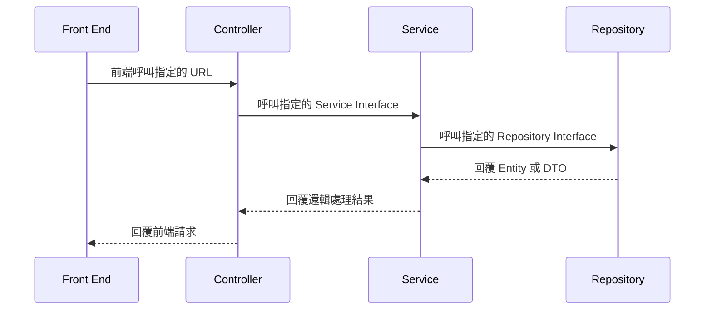

# 考試題目：請假系統

## 工具及框架
* 主要框架：SpringBoot + Spring MVC + JPA

## 資料庫
|資料表名稱|資料表說明|備註|
|-|--|--|
|HR_SYS_CODE|系統代碼表||
|HR_SYS_STAFF|員工基本資料表||
|HR_SYS_STAFF_ADDR|員工戶籍、通訊地址||
|HR_SYS_LOGIN|使用者登入識別值||

## SpringBoot 流程



# MA000. 範例：代碼檔查詢

## 串接格式

```
URL：localhost:8080/syscode
METHOD：POST
```

```json
上行電文:
{
   "header":{
       "sys":"HR-SYS",
       "api":"MA000",
       "time":1641275286261
   },
   "body":{
       "gp": "ZIP"
   }
}
```

```json
下行電文
{
    "header": {
       "sys":"HR-SYS",
       "api":"MA000",
       "time":1641275286261,
       "code": "0000",
       "desc": "查詢成功"
    },
    "body": {
        "gp": "ZIP",
        "data":[
            {
                "code"："100",
                "cname":"臺北市中正區"
            },
            {
                "code"："103",
                "cname":"臺北市大同區"
            },
            {
                "code"："104",
                "cname":"臺北市中山區"
            }
        ]
    }
}
```

|代碼|訊息|說明|
|-|--|--|
|0000|查詢成功||
|0001|查無資料||
|9999|系統發生異常，請聯絡系統管理員||

# MA001. 使用者登入

## 串接格式

```
URL：localhost:8080/login
METHOD：POST
```

```json
上行電文:
{
   "header":{
       "sys":"HR-SYS",
       "api":"MA001",
       "time":1641275286261
   },
   "body":{
       "iden": "A123456789",
       "pwd": "A123456"
   }
}
```

```json
下行電文
{
    "header": {
       "sys":"HR-SYS",
       "api":"MA001",
       "time":1641275286261,
       "code": "0000",
       "desc": "登入成功"
    },
    "body": {
        "token": "f739ab41-5608-441c-ba28-cb00c7be294e"
    }
}
```

>
> 處理邏輯
> * 檢查帳號、密碼是否正確
> * 若帳號、密碼通過檢查，則以 UUID 產生 Token
> * 將 產生的 Token 值寫入 HR_SYS_LOGIN 的資料表，其中 CRE_TIME 為當下系統時間，EFFECTIVE_TIME 為 CRE_TIME 加上 30 MIN
>

|代碼|訊息|說明|
|-|--|--|
|0000|登入成功||
|0001|查無使用者||
|0002|密碼錯誤||
|9999|系統發生異常，請聯絡系統管理員||


# MA002. 使用者資料查詢

## 串接格式

```
URL：localhost:8080/user
METHOD：POST
```

```json
上行電文:
{
   "header":{
       "sys":"HR-SYS",
       "api":"MA002",
       "time":1641275286261
   },
   "body":{
       "token": "f739ab41-5608-441c-ba28-cb00c7be294e"
   }
}
```

```json
下行電文
{
    "header": {
       "sys":"HR-SYS",
       "api":"MA002",
       "time":1641275286261,
       "code": "0000",
       "desc": "查詢成功"
    },
    "body": {
        "iden": "A123***789",
        "cname": "張三",
        "ename": "CHANGE",
        "birth": "1990-01-04",
        "sex": "男性"
    }
}
```

>
> 處理邏輯
> * 檢查 TOKEN 是否存在
> * 查查 TOKEN 是否逾期
> * 回傳該 TOKEN 的所屬使用者資料
> * 注意事項：IDEN 欄位回傳時，需進行資料隱碼（中間三碼）
>

|代碼|訊息|說明|
|-|--|--|
|0000|查詢成功||
|0001|查無登入資訊||
|0002|登入時間逾期||
|9999|系統發生異常，請聯絡系統管理員||

# MA003. 使用者變更密碼

## 串接格式

```
URL：localhost:8080/changepwd
METHOD：POST
```

```json
上行電文:
{
   "header":{
       "sys":"HR-SYS",
       "api":"MA003",
       "time":1641275286261
   },
   "body":{
       "token": "f739ab41-5608-441c-ba28-cb00c7be294e",
       "pwd":"abcd1234"
   }
}
```

```json
下行電文
{
    "header": {
       "sys":"HR-SYS",
       "api":"MA003",
       "time":1641275286261,
       "code": "0000",
       "desc": "變更密碼成功"
    }
}
```

>
> 處理邏輯
> * 檢查 TOKEN 是否存在
> * 查查 TOKEN 是否逾期
> * 變更密碼欄位：HR_SYS_STAFF.PWD
>

|代碼|訊息|說明|
|-|--|--|
|0000|變更密碼成功||
|0001|查無登入資訊||
|0002|登入時間逾期||
|0003|變更密碼失敗||
|9999|系統發生異常，請聯絡系統管理員||

# MA004. 使用者資料查詢（明細）

## 串接格式

```
URL：localhost:8080/user/all
METHOD：POST
```

```json
上行電文:
{
   "header":{
       "sys":"HR-SYS",
       "api":"MA004",
       "time":1641275286261
   },
   "body":{
       "token": "f739ab41-5608-441c-ba28-cb00c7be294e"
   }
}
```

```json
下行電文
{
    "header": {
       "sys":"HR-SYS",
       "api":"MA004",
       "time":1641275286261,
       "code": "0000",
       "desc": "查詢成功"
    },
    "body": {
        "iden": "A123***789",
        "cname": "張三",
        "ename": "CHANGE",
        "age": 31, // 以出生日期計算年齡
        "birth": "1990-01-04",
        "sex": "男性",
        "address":{
            "domicile": "110 台北市 基隆路 XXXX",   //戶籍地址
            "contact": "110 台北市 基隆路 XXXX"     //聯絡地址
        }
    }
}
```

>
> 處理邏輯
> * 檢查 TOKEN 是否存在
> * 查查 TOKEN 是否逾期
> * 回傳該 TOKEN 的所屬使用者資料
> * 注意事項：IDEN 欄位回傳時，需進行資料隱碼（中間三碼）
>

|代碼|訊息|說明|
|-|--|--|
|0000|查詢成功||
|0001|查無登入資訊||
|0002|登入時間逾期||
|9999|系統發生異常，請聯絡系統管理員||

# MA005. 使用者假別查詢

## 串接格式

```
URL：localhost:8080/user/leave
METHOD：POST
```

```json
上行電文:
{
   "header":{
       "sys":"HR-SYS",
       "api":"MA005",
       "time":1641275286261
   },
   "body":{
       "token": "f739ab41-5608-441c-ba28-cb00c7be294e",
       "year": 2022
   }
}
```

```json
下行電文
{
    "header": {
       "sys":"HR-SYS",
       "api":"MA005",
       "time":1641275286261,
       "code": "0000",
       "desc": "查詢成功"
    },
    "body": {
        "iden": "A123***789",
        "cname": "張三",
        "year": 2022,
        "leaves":[
            {
                "type": "A",
                "typeDesc": "特休",
                "ownHours": 80,
                "applyHours": 20,
                "totalHours": 60
            },
            {
                "type": "B",
                "typeDesc": "補休",
                "ownHours": 20,
                "applyHours": 5,
                "totalHours": 15
            },
            {
                "type": "C",
                "typeDesc": "事假",
                "ownHours": 0,
                "applyHours": 20,
                "totalHours": -20
            }
        ]
    }
}
```

>
> 處理邏輯
> * 檢查 TOKEN 是否存在
> * 查查 TOKEN 是否逾期
> * 回傳該 TOKEN 的所屬使用者資料
> * 注意事項：IDEN 欄位回傳時，需進行資料隱碼（中間三碼）
> * 資料庫：查詢 HR_SYS_LEAVE 資料
>

|代碼|訊息|說明|
|-|--|--|
|0000|查詢成功||
|0001|查無登入資訊||
|0002|登入時間逾期||
|0003|查無假別資料||
|9999|系統發生異常，請聯絡系統管理員||


# MA006. 使用者假別明細查詢

## 串接格式

```
URL：localhost:8080/user/leave/dtl
METHOD：POST
```

```json
上行電文:
{
   "header":{
       "sys":"HR-SYS",
       "api":"MA006",
       "time":1641275286261
   },
   "body":{
       "token": "f739ab41-5608-441c-ba28-cb00c7be294e",
       "year": 2022
   }
}
```

```json
下行電文
{
    "header": {
       "sys":"HR-SYS",
       "api":"MA006",
       "time":1641275286261,
       "code": "0000",
       "desc": "查詢成功"
    },
    "body": {
        "iden": "A123***789",
        "cname": "張三",
        "year": 2022,
        "leaves":[
            {
                "type": "A",
                "typeDesc": "特休",
                "ownHours": 80,
                "applyHours": 0,
                "beginTime": null,
                "endTime": null,
                "remark": "系統匯入",
                "creTime": "2022-01-01 00:00:00"
            },
            {
                "type": "A",
                "typeDesc": "特休",
                "ownHours": 0,
                "applyHours": 8,
                "beginTime": "2022-01-05 08:00",
                "endTime": "2022-01-05 18:00",,
                "remark": "請假（特休）",
                "creTime": "2022-01-05 07:10:22"
            },
            {
                "type": "C",
                "typeDesc": "事假",
                "ownHours": 0,
                "applyHours": 8,
                "beginTime": "2022-01-05 08:00",
                "endTime": "2022-01-05 18:00",,
                "remark": "請假（事假）",
                "creTime": "2022-01-05 07:10:22"
            }
        ]
    }
}
```

>
> 處理邏輯
> * 檢查 TOKEN 是否存在
> * 查查 TOKEN 是否逾期
> * 回傳該 TOKEN 的所屬使用者資料
> * 注意事項：IDEN 欄位回傳時，需進行資料隱碼（中間三碼）
> * 資料庫：查詢 HR_SYS_LEAVE_DTL 資料
>

|代碼|訊息|說明|
|-|--|--|
|0000|查詢成功||
|0001|查無登入資訊||
|0002|登入時間逾期||
|0003|查無明細資料||
|9999|系統發生異常，請聯絡系統管理員||


# MA007. 使用者請假

## 串接格式

```
URL：localhost:8080/user/leave/apply
METHOD：POST
```

```json
上行電文:
{
   "header":{
       "sys":"HR-SYS",
       "api":"MA007",
       "time":1641275286261
   },
   "body":{
       "token": "f739ab41-5608-441c-ba28-cb00c7be294e",
       "userId": "A123456789", 
       "type": "A",
       "hours": 8,
       "beginTime": "2022-01-02 09:00",
       "endTime": "2022-01-02 18:00"
   }
}
```

```json
下行電文(成功)
{
    "header": {
       "sys":"HR-SYS",
       "api":"MA007",
       "time":1641275286261,
       "code": "0000",
       "desc": "請假成功"
    }
}

下行電文(失敗)
{
    "header": {
       "sys":"HR-SYS",
       "api":"MA006",
       "time":1641275286261,
       "code": "1001",
       "desc": "請假失敗，假別（特休）時數不足"
    }
}
```

>
> 處理邏輯
> * 檢查 TOKEN 是否存在
> * 查查 TOKEN 是否逾期
> * 回傳該 TOKEN 的所屬使用者資料
> * 注意事項：IDEN 欄位回傳時，需進行資料隱碼（中間三碼）
> * 資料庫：請假成功需寫入 HR_SYS_LEAVE_DTL 資料，並異動 HR_SYS_LEAVE 主檔
> * 其他：需寄送一封郵件給使用者
>

### 相關設定
* 參考 https://www.baeldung.com/spring-email

``` properties
spring.mail.host=smtp.gmail.com
spring.mail.port=587
spring.mail.username=demo.taipei@gmail.com
spring.mail.password=geirrwupwwunehkg
spring.mail.properties.mail.smtp.auth=true
spring.mail.properties.mail.smtp.starttls.enable=true
mail.smtp.debug=true
```

|代碼|訊息|說明|
|-|--|--|
|0000|查詢成功||
|0001|查無登入資訊||
|0002|登入時間逾期||
|1001|請假失敗，假別（特休）時數不足||
|9999|系統發生異常，請聯絡系統管理員||


# MA008. 匯入國定假日主檔

## 串接格式

```
URL：localhost:8080/holiday
METHOD：POST
```

```json
上行電文:
{
   "header":{
       "sys":"HR-SYS",
       "api":"MA008",
       "time":1641275286261
   },
   "body":{
       "sys": "GOV",
       "year":2002
   }
}
```

```json
下行電文(成功)
{
    "header": {
       "sys":"HR-SYS",
       "api":"MA008",
       "time":1641275286261,
       "code": "0000",
       "desc": "執行成功"
    }
}

```

>
> 處理邏輯
> * 資料庫：資料需寫入 HR_SYS_HOLIDAY 資料

>

### 相關設定
* 資料資料：https://www.baeldung.com/rest-template
* 資料來源：https://quality.data.gov.tw/dq_download_json.php?nid=14718&md5_url=09eaae1844ccbafcbdb2a5ed2a2f79c3

``` java

    ObjectMapper mapper = new ObjectMapper();
    JsonNode root = mapper.readTree(response.getBody());
    for(int i = 0 ; i < root.size() ; i ++ ) {
        System.out.println(root.get(i).get("西元日期").asInt());
    }

```


|代碼|訊息|說明|
|-|--|--|
|0000|執行成功||
|1001|執行失敗||
|9999|系統發生異常，請聯絡系統管理員||
"# SpringBootLab-For-Test" 
